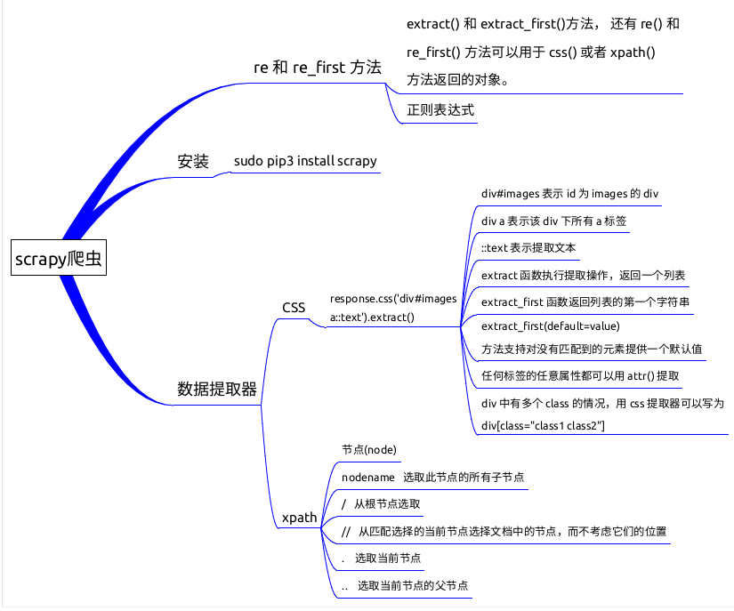

### 知识点

- scrapy 爬虫框架介绍
- scrapy 框架安装
- 数据提取器：CSS 和 XPATH
- scrapy shell
- 正则表达式数据提取

### 安装

为了方便管理 Python 版本和依赖包，首先可以创建一个 python3.5 的虚拟环境。

```bash
$ virtualenv -p python3.5 venv
$ . venv/bin/activate
```

后面的scrapy爬虫代码都是基于这个虚拟环境，安装 scrapy:

```bash
$ pip3 install scrapy
```

现在在命令行输入 scrapy，出现下面的内容说明已经安装成功了。
<!--more-->

```python
Scrapy 1.4.0 - no active project

Usage:
  scrapy <command> [options] [args]

Available commands:
  bench         Run quick benchmark test
  fetch         Fetch a URL using the Scrapy downloader
  genspider     Generate new spider using pre-defined templates
  runspider     Run a self-contained spider (without creating a project)
  settings      Get settings values
  shell         Interactive scraping console
  startproject  Create new project
  version       Print Scrapy version
  view          Open URL in browser, as seen by Scrapy

  [ more ]      More commands available when run from project directory

Use "scrapy <command> -h" to see more info about a command
```

### 数据提取器

`scrapy` 内置两种数据提取语法： `CSS` 和 `XPath` 。下面通过例子来看看怎么使用，有这样一个 HTML 文件：

```python
<html>
 <head>
  <base href='http://example.com/' />
  <title>Example website</title>
 </head>
 <body>
  <div id='images'>
   <a href='image1.html'>Name: My image 1 <br /></a>
   <a href='image2.html'>Name: My image 2 <br /></a>
   <a href='image3.html'>Name: My image 3 <br /></a>
   <a href='image4.html'>Name: My image 4 <br /></a>
   <a href='image5.html'>Name: My image 5 <br /></a>
  </div>
 </body>
</html>
```

这是 `scrapy` 官方提供的一个网页，方便我们练习 `Selector`，它的地址是

```python
http://doc.scrapy.org/en/latest/_static/selectors-sample1.html
```

### scrapy shell

`scrapy shell` 提供了一个交互式的 Python 环境方便我们测试和debug 爬虫，使用方法是

```python
scrapy shell [url]
```

需要提供一个网页的 url，执行命令后，scrapy 会自动去下载这个 url 对应的网页，将结果封装为 `scrapy` 内部的一个 `response` 对象并注入到 python shell 中，在这个 `response` 对象上，可以直接使用 scrapy 内置的css 和 xpath 数据提取器。

运行下面的命令下载上面的网页并进入 `shell`：

```python
scrapy shell http://doc.scrapy.org/en/latest/_static/selectors-sample1.html
```

对于网页的源代码分析，推荐使用 Chrome 浏览器，在页面上的元素右键选择 `检查` 可以得到源代码，在源代码上可以拷贝出 xpath 路径。

### CSS Selector

顾名思义，css selector 就是 css 的语法来定位标签。例如要提取例子网页中 ID 为 `images` 的 div 下所有 a 标签的文本，使用 css 语法可以这样写：

```python
>>> response.css('div#images a::text').extract()
['Name: My image 1 ', 'Name: My image 2 ', 'Name: My image 3 ', 'Name: My image 4 ', 'Name: My image 5 ']
```

`div#images` 表示 id 为 images 的 div，如果是类名为 images，这里就是 `div.images`。`div a` 表示该 div 下所有 a 标签，`::text` 表示提取文本，`extract` 函数执行提取操作，返回一个**列表**。如果只想要列表中第一个 a 标签下的文本，可以使用 `extract_first` 函数：

```python
>>> response.css('div#images a::text').extract_first()
'Name: My image 1 '
```

`extract_first()` 方法支持对没有匹配到的元素提供一个默认值：

```python
>>> response.css('div#images p::text').extract_first(default='默认值')
'默认值'
```

`div#images` 下面并没有 p 标签，所以会返回提供的默认值。如果不提供 default 值的话会返回 None。

如果要提取所有 a 标签的 href 链接，可以这样写：

```python
>>> response.css('div#images a::attr(href)').extract()
['image1.html', 'image2.html', 'image3.html', 'image4.html', 'image5.html']
```

不只是 `href`，任何标签的任意属性都可以用 `attr()` 提取。基于上面的知识，就能轻松写出提取所有图片的链接地址：

```python
>>> response.css('div#images a img::attr(src)').extract()
['image1_thumb.jpg', 'image2_thumb.jpg', 'image3_thumb.jpg', 'image4_thumb.jpg', 'image5_thumb.jpg']
```

如果 div 中有多个 class 的情况，用 css 提取器可以写为 `div[class="class1 class2"]`

### XPath

XPath (XML Path Language) 是一门路径提取语言，最初被设计用来从 XML  文档中提取部分信息，现在它的这套提取方法也可以用于 HTML 文档上。

下面我们通过一个例子来看看这些规则的用法。

假设有下面这样一份 HTML 文档，它列出了一些世界知名的 IT 公司及其相关信息，将这份文档保存为 `example.html`。

```python
<!DOCTYPE html>
<html>
<head>
  <title>xpath</title>
</head>
<body>
  <div class="companies">
    <div class="company">
      <h2>阿里巴巴</h2>
      <a href="alibaba.com"></a>
      <p class="location">杭州</p>
    </div>
    <div class="company">
      <h2>腾讯</h2>
      <a href="qq.com"></a>
      <p class="location">深圳</p>
    </div>
    <div class="company">
      <h2>Facebook</h2>
      <a href="facebook.com"></a>
      <p class="location">硅谷</p>
    </div>
    <div class="company">
      <h2>微软</h2>
      <a href="microsoft.com"></a>
      <p class="location">西雅图</p>
    </div>
  </div>
</body>
</html>
```

在使用 xpath 前，大家首先要把几个概念弄明白。首先，什么是 `节点(node)`，以上面的文档为例子，每个标签都是一个节点，比如，

```python
<div class="company">
  <h2>腾讯</h2>
    
  <p class="location">深圳</p>
</div>
```

这里最外层的 div 是整个文档的一个子节点，里面包含公司信息标签都是 div 的子节点，节点标签之间的内容称为这个节点的文本(text)，如 `腾讯` 是 `h2` 标签的文本。节点标签内部的称为节点的属性(attribute)，如 `src` 是 `img` 标签的一个属性，每个标签都可以有 `class` 属性。每个属性都有一个或多个对应的值（class 属性可以有多个值）。那么爬虫的主要目的其实就是从一个文档中获取需要的文本或者属性的值。

进入 `scrapy shell` ，由于没有下载链接，我们将 `example.html` 文档手动构建成  `response` 对象，然后就可以在 `response` 对象上直接使用 `xpath` 方法了：

```python
>>> from scrapy.http import HtmlResponse
>>> body = open('example.html').read()
>>> response = HtmlResponse(url='http://example.com', body=body.encode('utf-8'))
```

节点选择的基规则如下：

| 表达式   | 描述                                                       |
| -------- | ---------------------------------------------------------- |
| nodename | 选取此节点的所有子节点。                                   |
| /        | 从根节点选取。                                             |
| //       | 从匹配选择的当前节点选择文档中的节点，而不考虑它们的位置。 |
| .        | 选取当前节点。                                             |
| ..       | 选取当前节点的父节点。                                     |

`/` 表示从根节点开始选取，比如，你想要选取 `title` 节点，就需要按标签的阶级关系来定位：

```
>>> response.xpath('/html/head/title').extract()
['<title>xpath</title>']
```

而实用 `//` 就可以不必管标签在文档中的位置：

```
>>> response.xpath('//title').extract()
['<title>xpath</title>']
```

当选取到的标签不止一个的时候，会返回一个列表，比如我们选取所有公司的名称所在的 `h2` 标签：

```
>>> response.xpath('//h2').extract()
['<h2>阿里巴巴</h2>', '<h2>腾讯</h2>', '<h2>Facebook</h2>', '<h2>微软</h2>']
```

可以在选择表达式后面加上 `text()` 来指定只返回文本：

```
>>> response.xpath('//h2/text()').extract()
['阿里巴巴', '腾讯', 'Facebook', '微软']
```

而如果想要选取属性值，在属性名称前面加上 *@* 符号就可以了，比如我们选取所有 `img` 的 `src` 属性：

```
response.xpath('//img/@src').extract()
['alibaba.jpg', 'qq.jpg', 'facebook.jpg', 'microsoft.jpg']
```

我们同样可以用属性来定位节点，比如我们要选取所有 `class` 属性值为 `location` 的 `p`内的文本：

```
>>> response.xpath('//p[@class="location"]/text()').extract()
['杭州', '深圳', '硅谷', '西雅图']
```

在节点名称后面加上 `[n]` ，n 是一个数字，这样可以获取到该节点下某个子节点的第 n 个，比如我们要获取 `div.companies` 下的第二个 `div` 子 节点，也就是腾讯所在的 `div` 节点，那么可以这样写：

```
response.xpath('//div[@class="companies"]/div[2]')
[<Selector xpath='//div[@class="companies"]/div[2]' data='<div class="company">\n      <h2>腾讯</h2>\n'>]
```

scrapy 中，对 xpath 方法的选取到的对象可以进一步运用 xpath 方法，比如上一步中，我们需要到了腾讯所在的 div 标签，现在我们想在当前结果基础上进一步获取公司的网址，你可能会写出这样的代码：

```
>>> response.xpath('//div[@class="companies"]/div[2]').xpath('//a/@href').extract()
['alibaba.com', 'qq.com', 'facebook.com', 'microsoft.com']
```

这时候你发现返回的其实是所有 `a` 标签的 `href`，这是因为 `//` 是基于整个文档来选择的，如果想要基于当前已经选择了的部分运用 xpath 方法， 则要在 `//` 前面加上 `.` 号：

```
>>> response.xpath('//div[@class="companies"]/div[2]').xpath('.//a/@href').extract()
['qq.com']
```

前面我们说到过，一个标签的属性值可以存在多个，比如 `<div class=“name1 name2 name3”>hello</div>`，这种情况下进行定位的时候，把所有类名都写上就比较麻烦。这时候可以选取一个能唯一代表该 `div` 的类名，假设我们选了 name2，然后可以使用 `contains(@attr, "value")` 方法，该方法表示，只要标签的属性包含指定的值就可以：

```
>>> response.xpath('//div[contains(@class, "name2")]/text()').extract() 
['hello']
```

### re 和 re_first 方法

除了 `extract()` 和 `extract_first()`方法， 还有 `re()` 和 `re_first()` 方法可以用于 `css()` 或者 `xpath()` 方法返回的对象。

使用 `extract()` 直接提取的内容可能并不符合格式要求，比如上面的 CSS 提取器例子中，获取的第一个 a 标签的 text 是这样的：`Name: My image 1`，现在要求不要开头的 `Name:` 和结尾的空格，这时候就可以使用 `re()` 替代 `extract` 方法，使用正则表达式对提取的内容做进一步的处理：

```
>>> response.css('div#images a::text').re('Name: (.+) ')
['My image 1', 'My image 2', 'My image 3', 'My image 4', 'My image 5']
```

`re()`  方法中定义的正则表达式会作用到每个提取到的文本中，只保留正则表达式中的子模式匹配到的内容，也就是 `()` 内的匹配内容。

`re_first()` 方法支持只作用于第一个文本：

```
>>> response.css('div#images a::text').re_first('Name: (.+) ')
'My image 1'
```

### 知识点思维导图


